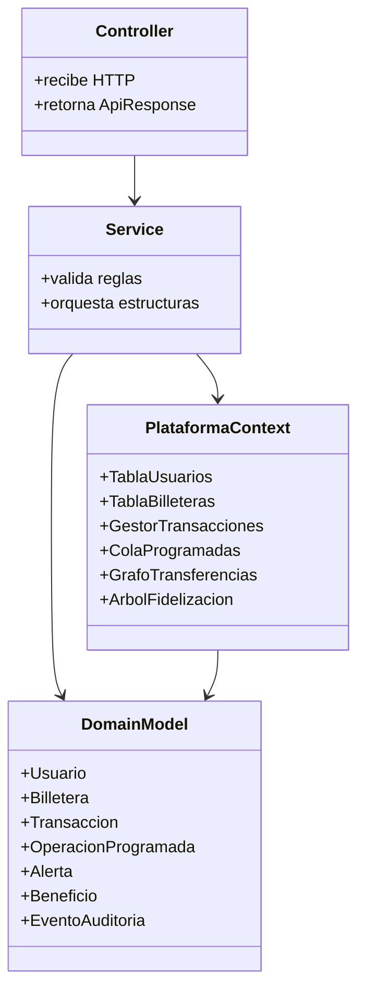

# Arquitectura

La aplicacion usa una arquitectura por capas sencilla para mantener separadas
las responsabilidades del proyecto academico.

## Flujo de una transferencia

1. `TransaccionController` recibe una solicitud en `/api/transacciones/transferir`.
2. `TransaccionService` valida billeteras, saldo y estado.
3. `BilleteraService` descuenta saldo de origen y suma saldo al destino.
4. `GestorTransacciones` registra el historial y la pila de reversion.
5. `GrafoTransferencias` registra la relacion entre usuarios.
6. `SistemaRecompensas` calcula puntos y actualiza nivel del usuario.
7. `TransaccionService` evalua riesgo y registra auditoria si aplica.
8. `NotificacionService` conserva alertas recientes por usuario.

## Decisiones

- La persistencia es en memoria porque el objetivo del proyecto es demostrar
  estructuras de datos, no una base de datos.
- Los servicios son `@Service` de Spring para conservar una API REST limpia.
- `PlataformaContext` centraliza las estructuras compartidas y evita duplicar
  estado entre servicios.
- Las validaciones de negocio lanzan excepciones controladas por
  `ApiExceptionHandler`.
